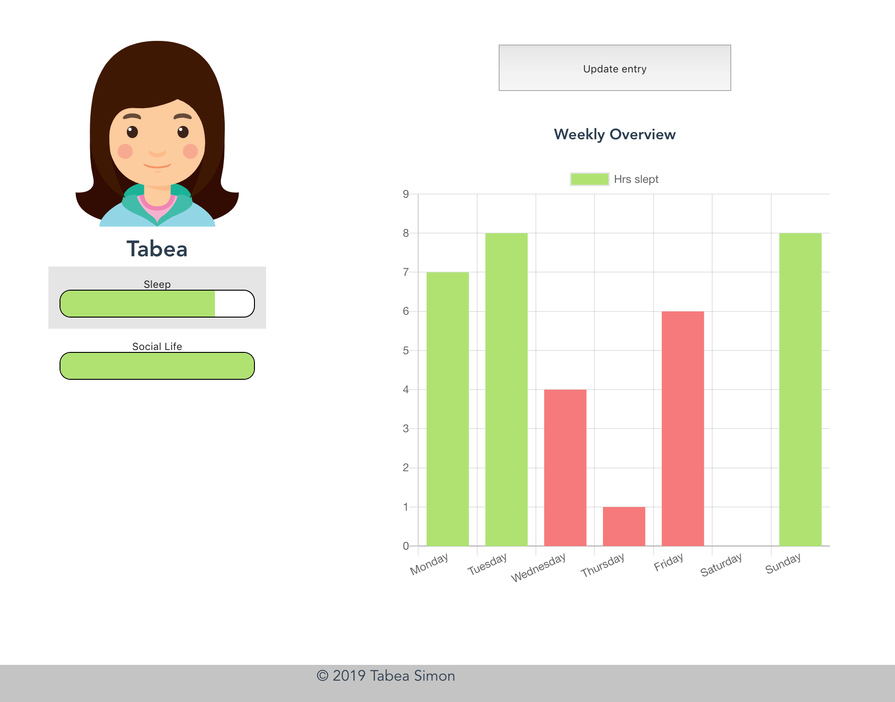
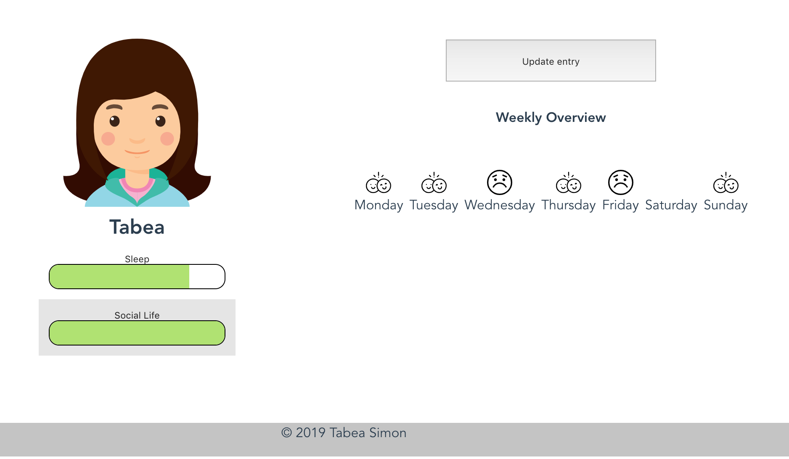

# Track your needs
The App lets you keep track of your basic needs: sleep, social life, nutrition and sport. 

By filling in your needs daily and seeing a weekly overview you notice which needs to take better care of. 

If a need is fulfilled the correlating need bar is green but if you, for example, don't get enough sleep the bar turns red.




# Future Work
- Add more needs: nutrition + sport
- Add styling + improve responsiveness
- Enable users to add friends and track who they talked to

# Technology Stack
Vue JS
Google Firebase + Firestore
SASS + Bulma
Jest

## Project setup
```
git clone https://github.com/tabea89/need_tracker_app.git
```

```
npm install
```

### Compiles and minifies for production
```
npm run build
```

### Compiles and hot-reloads for development
```
npm run serve
```

### Run your tests
```
npm run test
```

### Lints and fixes files
```
npm run lint
```

### Customize configuration
See [Configuration Reference](https://cli.vuejs.org/config/).
